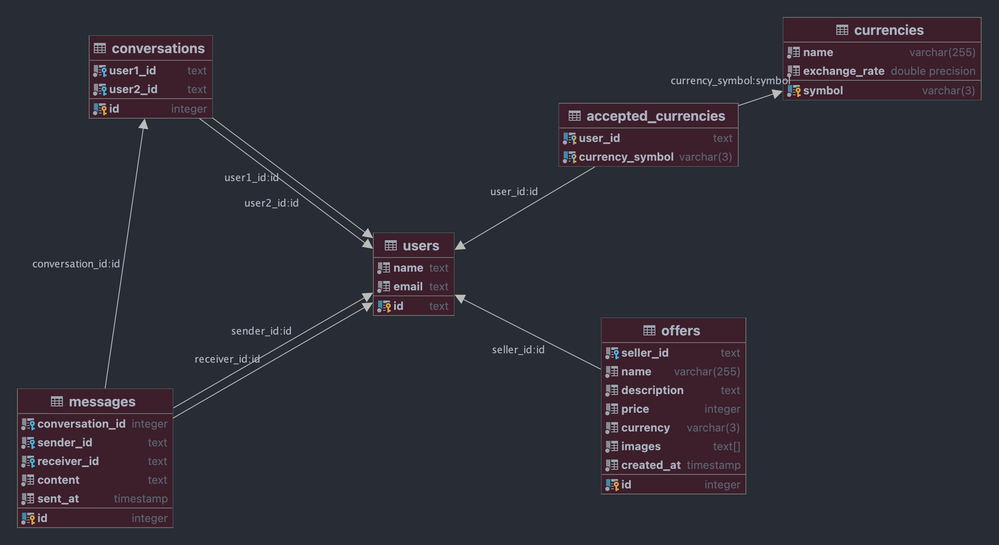

# harnaś

## Database schema


## API endpoints

### GET `/offer/<id>`
Returns offer with given id.

If the offer is found:
200 OK
```json
{
  "created_at": "Mon, 31 Oct 2022 18:32:19 GMT",
  "description": "Bardzo \u0142adna p\u00f3\u0142eczka we wspania\u0142ym stanie",
  "id": 1,
  "images": [],
  "price": {
    "amount": 4,
    "currency": {
      "name": "Harna\u015b",
      "symbol": "HAR",
      "value": 1
    }
  },
  "seller": {
    "accepted_currencies": [
      {
        "name": "Harna\u015b",
        "symbol": "HAR",
        "value": 1
      }
    ],
    "email": "karol@kucza.xyz",
    "name": "Karol",
    "uid": "KyumBFaY66ZdS3oG7fPZQZycKyC2"
  },
  "title": "P\u00f3\u0142eczka"
}
```

If the offer is not found:
400 Bad Request

If the internal server error occurs:
500 Internal Server Error

### GET `/offers/search/<query>/<page>`
Returns offers matching given query.

Response:
200 OK
```json
INSERT EXAMPLE RESPONSE HERE
```

If the internal server error occurs:
500 Internal Server Error

### GET `/offers/<page>`
Returns offers from given page.

Response:
200 OK
```json
INSERT EXAMPLE RESPONSE HERE
```

If the internal server error occurs:
500 Internal Server Error

### GET `/user/<id>/offers`
Returns offers from given user.

If the user id is correct:
200 OK
```json
INSERT EXAMPLE RESPONSE HERE
```

If the user id is incorrect:
400 Bad Request

If the internal server error occurs:
500 Internal Server Error

### POST `/offer`
Creates new offer.

Request:
```json
{
    "seller_id": "KyumBFaY66ZdS3oG7fPZQZycKyC2",
    "currency": "HAR",
    "price": 2,
    "title": "Dupa jasia",
    "description": "Debil"
}
```

If the offer is created: 
200 OK
```json
{
    "created_at": "Sun, 13 Nov 2022 11:12:03 GMT",
    "description": "Debil",
    "id": 3,
    "images": [],
    "price": {
        "amount": 2,
        "currency": {
            "name": "Harna\u015b",
            "symbol": "HAR",
            "value": 1.0
        }
    },
    "seller": {
        "accepted_currencies": [
            {
                "name": "Harna\u015b",
                "symbol": "HAR",
                "value": 1.0
            }
        ],
        "email": "karol@kucza.xyz",
        "name": "Karol",
        "uid": "KyumBFaY66ZdS3oG7fPZQZycKyC2"
    },
    "title": "Dupa jasia"
}
```

If the seller id is incorrect or if the currency is not accepted:
400 Bad Request

If the internal server error occurs:
500 Internal Server Error

### POST `/images`
**WIP**

### GET `/user/<id>`
Returns user with given id.

If the user is found:
200 OK
```json
{
  "accepted_currencies": [
    {
      "name": "Harna\u015b",
      "symbol": "HAR",
      "value": 1.0
    }
  ],
  "email": "karol@kucza.xyz",
  "name": "Karol",
  "uid": "KyumBFaY66ZdS3oG7fPZQZycKyC2"
}
```

If the user is not found:
400 Bad Request

If the internal server error occurs:
500 Internal Server Error

### PUT `/user/<id>`
Puts the user with given id. Should be called after the user is created.

If the user is found:
200 OK
```json
{
  "accepted_currencies": [
    {
      "name": "Harna\u015b",
      "symbol": "HAR",
      "value": 1.0
    }
  ],
  "email": "karol@kucza.xyz",
  "name": "Karol",
  "uid": "KyumBFaY66ZdS3oG7fPZQZycKyC2"
}
```

If the user is not found:
400 Bad Request

If the internal server error occurs:
500 Internal Server Error

### PATCH `/user/<id>`
Updates the user with given id.

**WIP**

### GET `/user/<id>/conversations`
Returns conversations from given user.


### POST `/message`
Creates new message.

Example request:
```json
{
    "sender_id": "KyumBFaY66ZdS3oG7fPZQZycKyC2",
    "receiver_id": "iELOTJC3k6VMCrrtamFq7907REz1",
    "content": "Dupa 12345"
}
```

If sending the message is successful: 200 OK
```json
{
    "content": "Dupa 12345",
    "is_sent": true,
    "message_id": 7,
    "receiver": {
        "accepted_currencies": [
            {
                "name": "Harna\u015b",
                "symbol": "HAR",
                "value": 1.0
            }
        ],
        "email": "john.doe@example.com",
        "name": "John",
        "uid": "iELOTJC3k6VMCrrtamFq7907REz1"
    },
    "sender": {
        "accepted_currencies": [
            {
                "name": "Harna\u015b",
                "symbol": "HAR",
                "value": 1.0
            }
        ],
        "email": "karol@kucza.xyz",
        "name": "Karol",
        "uid": "KyumBFaY66ZdS3oG7fPZQZycKyC2"
    },
    "sent_at": "Sun, 13 Nov 2022 11:21:40 GMT"
}
```

If at least one of the users is not found:
400 Bad Request

If the internal server error occurs:
500 Internal Server Error

### GET `/currencies`
Returns all currencies.

Response:
200 OK
```json
[
  {
    "name": "Harna\u015b",
    "symbol": "HAR",
    "value": 1.0
  }
]
```

If the internal server error occurs:
500 Internal Server Error

### GET `/health`
Returns health status of the server.

Response if the server is healthy:
200 OK
```json
{
  "healthy": true,
  "message": null
}
```

Response if the server is unhealthy:
500 Internal Server Error
```json
{
  "healthy": false,
  "message": "Database is not available"
}
```

Or no response at all if the server is down.
